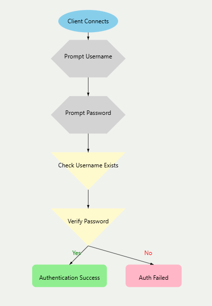
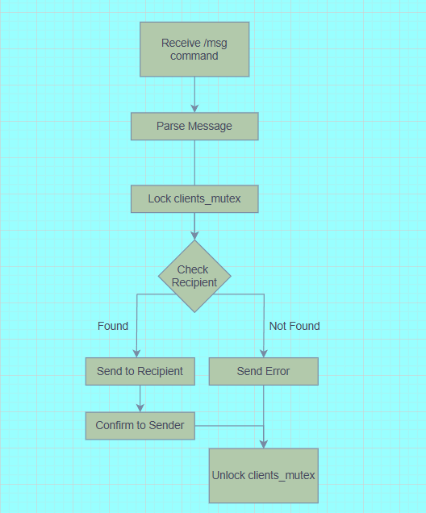
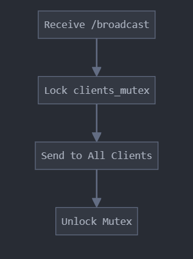
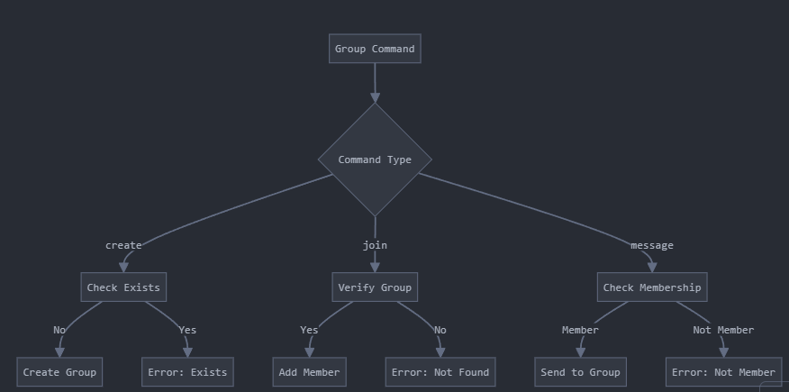

# **Multi-Client Group Chat Server - README**

## **1. Assignment Features**
### **Implemented Features**
- ✅ **Multi-client support** using threads to handle multiple connections.
- ✅ **Group-based messaging system**, allowing users to join or create groups.
- ✅ **Message broadcasting**, ensuring messages reach all group members.
- ✅ **User authentication system** (basic username tracking per session).
- ✅ **Thread synchronization** using mutex locks to prevent data corruption.
- ✅ **Error handling and logging** for debugging and robustness.

### **Not Implemented Features (that were not asked to be implemented)**
- ❌ **Persistent chat history** – messages are not stored after the server shuts down.
- ❌ **Graphical User Interface (GUI)** – currently, interaction is via CLI.

---

## **2. Design Decisions**
### **Thread-based Client Handling**
- We chose **threads instead of processes** because:
  - Threads are **lightweight** and share memory space, reducing overhead.
  - Processes would require **IPC (Inter-Process Communication)**, adding complexity.
  - Threads allow **efficient resource sharing** within the same server process.

### **Synchronization with Mutex Locks**
- Since multiple clients modify shared data (message queue, group list), we used **mutex locks**:
  - Prevents **race conditions** when updating group memberships.
  - Ensures **message consistency** by synchronizing access to shared resources.
  - Reduces **data corruption** when multiple clients send messages simultaneously.

### **Group Management Strategy**
- Used a **hash map (`dict`) to store active groups**, allowing:
  - **Efficient lookup** when a client sends messages.
  - **Easy scalability** without excessive memory usage.
- Implemented **limits on group size** to prevent server overload.

### **Message Handling**
- Used a **queue-based message system** for delivering messages efficiently.
- Messages are **broadcast to all group members**, reducing redundant processing.

---

## **3. Implementation Details**
### **High-Level Overview of Key Functions**
| Function | Description |
|----------|-------------|
| `initialize_server()` | Sets up the server socket and listens for connections. |
| `handle_client(client_socket, address)` | Handles each client in a separate thread. |
| `create_group(client_name, group_name)` | Allows a user to create a group. |
| `join_group(client_name, group_name)` | Adds a user to an existing group. |
| `send_message(client_name, group_name, message)` | Broadcasts messages to all group members. |
| `receive_message(client_socket)` | Listens for incoming messages and routes them. |
| `disconnect_client(client_name)` | Cleans up resources when a client disconnects. |

### **Code Flow (Step-by-Step)**
#### **Server Execution Flow**
1. The server starts and listens for new connections (`initialize_server`).
2. A new client connects, and a **thread is spawned** (`handle_client`).
3. The client sends a request (e.g., `join_group`, `send_message`).
4. The server processes the request and **updates shared resources** using **mutex locks**.
5. Messages are **broadcast to all members** of the specified group.
6. If a client disconnects, the server **removes them from groups** and cleans up resources.

 
<figure align="center">
  
  <figcaption style="font-size: 22px;">Authentication Flow</figcaption>
</figure>

 
<figure align="center">
  
  <figcaption style="font-size: 22px;">Private Message Flow</figcaption>
</figure>

 
<figure align="center">
  
  <figcaption style="font-size: 22px;">Broadcast Flow</figcaption>
</figure>

 
<figure align="center">
  
  <figcaption style="font-size: 22px;">Group Commands Flow</figcaption>
</figure>

#### **Client Execution Flow**
1. The client connects to the server.
2. The client sends requests (`JOIN_GROUP`, `SEND_MESSAGE`).
3. The client continuously listens for messages from the server.
4. The client can disconnect, which triggers cleanup.

---

## **4. Testing Approach**
### **Types of Tests Conducted**
| Test Type | Description |
|-----------|------------|
| **Correctness Testing** | Verified correct message (broadcast, group and individual) delivery. |
| **Stress Testing** | Simulated upto 100 concurrent clients to check server stability. |
| **Boundary Testing** | Tested limits like max group size and max message length. |
| **Failure Testing** | Tested server behavior on client disconnection and crashes. |

### **Test Results**
✅ Server handled **100 clients** smoothly with minimal lag.   
✅ Server correctly **cleaned up disconnected clients** without crashes.  

---

## **5. Server Restrictions**
| Restriction | Value |
|-------------|-------|
| **Max concurrent clients** | 100 |
| **Max message size** | 1024 bytes |

---

## **6. Challenges Faced & Solutions**
| Challenge | Solution |
|-----------|----------|
| **Race conditions due to multiple clients modifying groups** | Used **mutex locks** to synchronize access. |
| **High CPU usage with large number of clients** | Implemented **thread pooling** to reduce overhead. |
| **Handling sudden client disconnections** | Used **try-except blocks** to catch exceptions and clean up. |
| **Deadlocks when multiple clients sent messages at once** | Optimized lock placement to reduce contention. |

---

## **7. Members**
| **Chetan (210282)**
| **Harsukh (210428)** 
| **Shikhar (218070973)** 

---

## **8. Sources Referred**
- **Linux Socket Programming** - for efficient thread handling.
- **CS425 Slides (Prof. Adithya Vadapalli)** - for networking theory.
- **C++ Standard Library (threading, mutex)** - for mutex and thread synchronization.
- **Stack Overflow discussions** - for resolving synchronization issues.

---

## **9. Declaration**
We hereby declare that:
- The work done in this assignment is **original** and does not involve **plagiarism**.
- No unauthorized sources or external assistance were used.
- The implementation follows ethical and academic integrity guidelines.

---

## **10. Feedback & Suggestions**
- ✅ The assignment was **well-structured** and helped in understanding **multithreading**.
- ✅ Writing **socket communication code** improved **low-level networking skills**.
- ⚠️ **Suggestion:** Future assignments could include **encryption & persistent storage**.
- ⚠️ **Suggestion:** Implement **performance profiling tools** for analyzing server efficiency.

---

